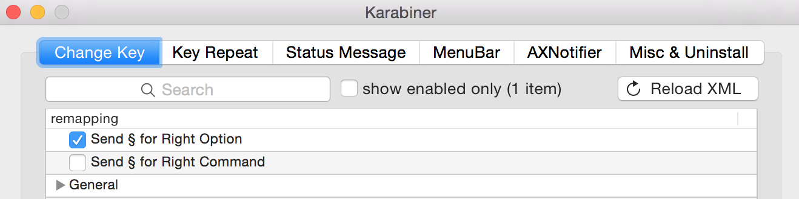

# What is a compose key?

A "compose" key is an input method used for complex characters.  It allows you to press your compose key (I bind mine to right-alt on my mac keyboard), and then type something, for instance:

* `[Compose]`, `+`, `1` = `👍`
* `[Compose]`, `s`, `h`, `r`, `u`, `g` = `¯\_(ツ)_/¯`

This repo contains my compose key setup but should easily allow you to create your own powerful compositions.  The [`DefaultKeyBinding.dict`](DefaultKeyBinding.dict) file contains a tree of "composition".  I entertain pull requests to add new shortcuts you feel are important to your day to day.

You can read more about it on the [blog that inspired this setup](http://lolengine.net/blog/2012/06/17/compose-key-on-os-x).

# Setting up a "Compose Key" in Mac OS X

```bash
git clone https://github.com/gnarf/osx-compose-key.git
./install.sh
```

You can also install it manually, if you prefer:

## For all versions of OS X

```bash
mkdir -p ~/Library/KeyBindings
curl 'https://raw.githubusercontent.com/gnarf/osx-compose-key/master/DefaultKeyBinding.dict' -o ~/Library/KeyBindings/DefaultKeyBinding.dict
```

Note: changes to `~/Library/KeyBindings/DefaultKeyBinding.dict` require quitting and restarting any apps you want to test them in.

## For OS X 10.12 Sierra

Install [Karabiner-Elements](https://github.com/tekezo/Karabiner-Elements) for remapping keys support, and download these files into the correct places:

```bash
brew cask install karabiner-elements
mkdir -p ~/.karabiner.d/configuration
curl 'https://raw.githubusercontent.com/gnarf/osx-compose-key/master/karabiner.json' -o ~/.karabiner.d/configuration/karabiner.json
```

In Karabiner-Elements under the Simple Modifications tab, click "Add item". Set the "From key" to "right_option" (or "right_command" if you use right alt) and "To key" to "non_us_backslash":


## For OS X 10.11 and below

Install [Karabiner](https://pqrs.org/osx/karabiner/) for remapping keys support, and download these files into the correct places:

```bash
brew cask install karabiner
mkdir -p ~/Library/Application\ Support/Karabiner
curl 'https://raw.githubusercontent.com/gnarf/osx-compose-key/master/private.xml' -o ~/Library/Application\ Support/Karabiner/private.xml
```

In Karabiner, enable "Send § for Right Option" (or right command if you use right alt):



Note: changes to `~/Library/KeyBindings/DefaultKeyBinding.dict` require quitting and restarting any apps you want to test them in.
